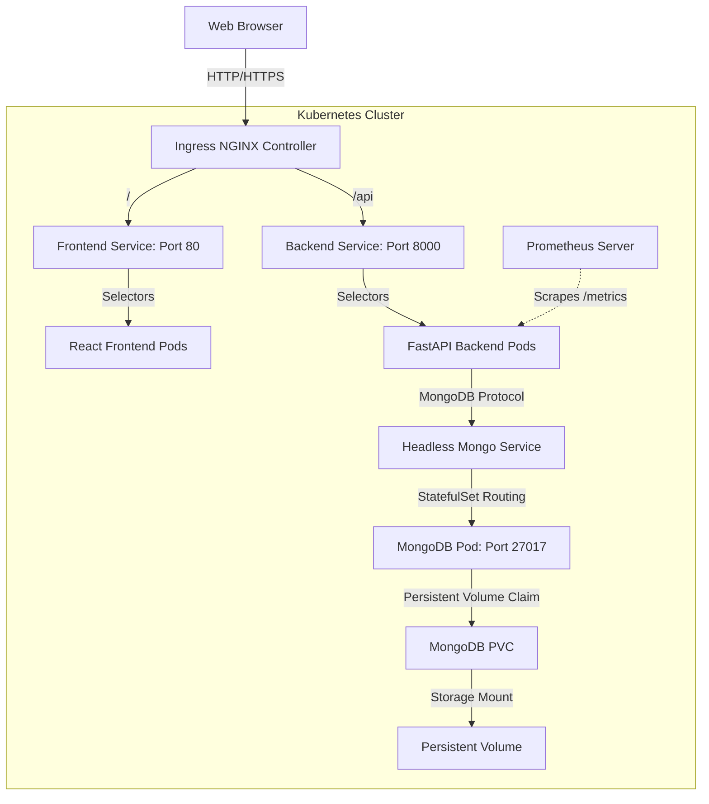

# Architecture Reference Guide

This document describes the design, components, and data flow of the NexShop E-Commerce platform.

## System Overview

NexShop is a microservices-based e-commerce platform built for cloud-native orchestration. It contains three main tiers:

## Tech Stack

1. **Frontend**: React SPA built with Vite, styled using Tailwind CSS, communicating via Axios to `/api` routes.
2. **Backend**: FastAPI (Python) serving async REST endpoints instrumented with Prometheus middleware for application monitoring.
3. **Database**: MongoDB (v6.0) managed via a StatefulSet, using a headless service for DNS resolution and PV/PVC local hostPath storage for data persistence.
4. **Ingress**: Ingress-NGINX routing traffic to the corresponding service based on request paths.
5. **Autoscaling**: Horizontal Pod Autoscalers (HPA) configured for frontend and backend deployments scaling replica size based on CPU utilization metrics.

## Communication Paths

- **Public Access**: Users access the platform via `http://ecommerce.local` mapped through local DNS (`/etc/hosts`) to the Ingress controller IP.
- **Internal Routing**:
  - Web UI requests matching `/api/*` are forwarded by Ingress to `http://backend:8000/api/*`.
  - Frontend requests (all other paths) are served from `http://frontend:80`.
- **Database Operations**: The FastAPI pods connect to MongoDB using the headless DNS endpoint `mongodb-headless:27017`.
